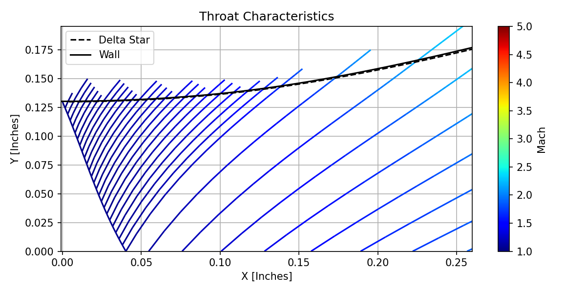
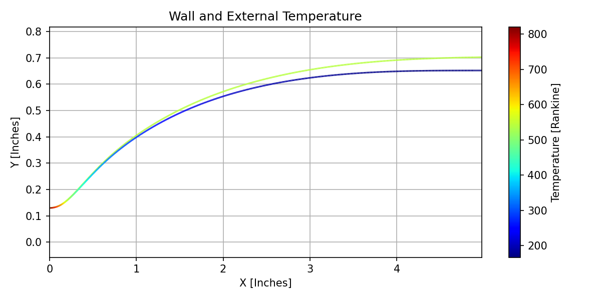
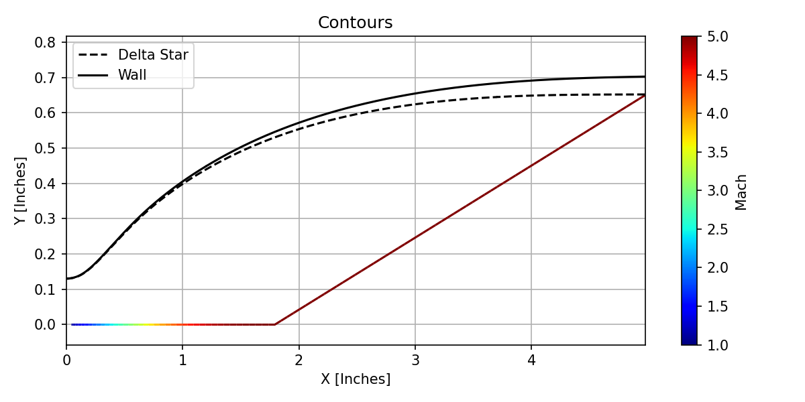
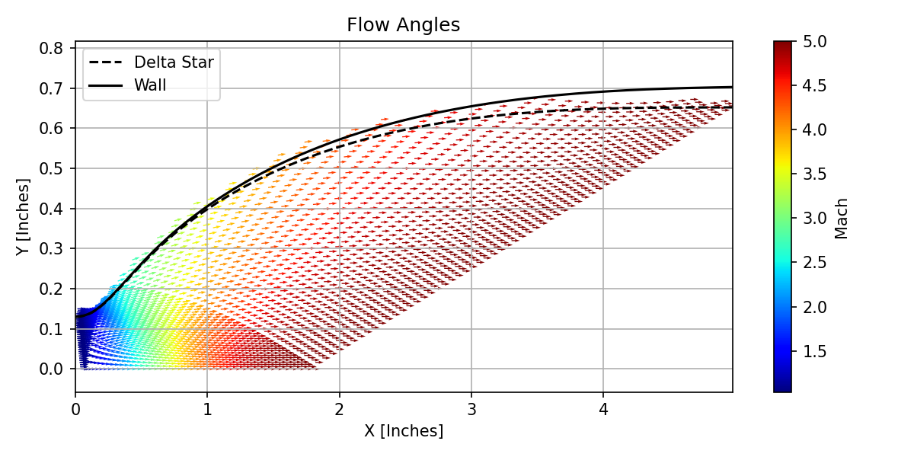
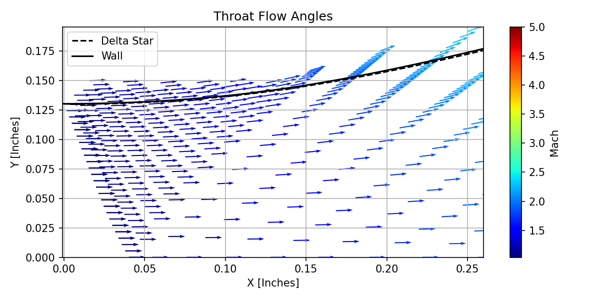

# ConturPy: Python Hypersonic Nozzle Design


## Introduction
ConturPy is a python library that provides an interface to J. C. Sivells' CONTUR program for supersonic and hypersonic 
nozzle design. 

This repository provides compiled binaries for both Windows x86 and Apple Silicon, tested on an AMD Ryzen R3900XT and an 
Apple M1 on MacOS. Other architectures will need to compile the Fortran code from src and provide an explicit path to the
executable through the `executable` keyword argument for `ContourApplication`.

## Background
The code largely relies on Sivells' CONTUR code ported to 
modern Fortran by F.-L. Zavalan [here](https://github.com/aldorona/contur), many thanks to F. Zavalan and A. Rona. 
The axial.f source file has been modified from their port, however: S. Schneider notes in 
[NASA CR 197286](https://ntrs.nasa.gov/api/citations/19950015019/downloads/19950015019.pdf) 
that Sivells' code does not produce streamlines when ETAD is not 60. Schneider fixed the problem by modifying the AXIAL
subroutine by duplicating lines 111 and 112 above line 43. The same change has been made to the axial.f source file.

## Dependencies
- numpy >~ 1.22
- matplotlib >~ 3.5

## Usage
ConturPy is designed to do 4 things:
1. Create input cards for CONTUR
2. Wrap the CONTUR executable
3. Interpret the CONTUR results
4. Create images and tables for all CONTUR outputs

---
### Creating input cards
ConturPy provides the `ConturSettings` class that produces input cards in the format that CONTUR accepts. To start, 
create an instance of the `ConturSettings` class:

```python
from conturpy import ConturSettings
cs = ConturSettings()
```
`ConturSettings` accepts multiple keyword arguments which are not covered here. Once the object is created, assign 
values to each of the input fields and save the file to a convenient location:

```python
from conturpy import ConturSettings
cs = ConturSettings()

dmach = 6.0               # design mach
throat_radius = 0.65 / 2  # inches

# Card 1: the title of the simulation
cs["ITLE"] = f"Mach {dmach}"

# Card 2 contains gas properties. As air is the assumed working fluid, no changes are required

# Card 3: key design parameters
cs["ETAD"] = 60      # Angle at point D
cs["RC"] = 6.0       # Radius of curvature at throat [multiple of throat radius]
cs["CMC"] = dmach    # Design mach
cs["SF"] = throat_radius

# Card 6 (B): stagnation and heat transfer properties
cs["PPQ"] = 120      # Stagnation pressure [psia]
cs["TO"] = 1000      # Stagnation temperature [R]
cs["TWT"] = 540      # Wall temperature [R]
cs["TWAT"] = 540     # Water-cooling temp [R] (suggest setting to TWT since water cooling not assumed)

# Card 7 (D): interpolation parameters
cs["XLOW"] = 0       # Point to begin interpolating contour [in]
cs["XEND"] = 20      # Point to end interpolating contour [in]
cs["XINC"] = .1      # Increment to interpolate by [in]

# Create the input text file and save it to 'm5.0.txt' in the folder 'inputcards'
# ! Important ! the folder for output_directory must already exist
cs.print_to_input(file_name=f'm{dmach:.1f}.txt', output_directory='inputcards')
```

---
### Running CONTUR
Once your input cards have been created, `ConturApplication` wraps CONTUR and can process the input cards, producing 
CONTUR output text files and instances of the `ConturResult` class. ConturApplication provides three methods for running
CONTUR:
1. `ConturApplication.run()` runs CONTUR in the current working directory: `input.txt` is read and `output.txt` is 
created. Returns `True` if CONTUR doesn't timeout, else `False`.
2. `ConturApplication.batch_input_files(file_list, output_dir=os.getcwd(), refine_amt=21)` takes every file name in 
`file_list`, runs CONTUR in the local directory, and saves the outputs to the directory `output_dir` by appending 
`_result.txt` to the original input file name. This returns a list of `ConturResults` for every successful input, 
interpolating between the coordinates by `refine_amt` many points.
3. `ConturApplication.batch_input_folder(folder, output_dir=os.getcwd(), refine_amt=21)` takes every file in 
`folder`, runs CONTUR in the local directory, and saves the outputs to the directory `output_dir` by appending 
`_result.txt` to the original input file name. This returns a list of `ConturResults` for every successful input, 
interpolating between the coordinates by `refine_amt` many points.

If running on an architecture other than Windows x86_64 or Apple Silicon ARM_64, CONTUR must be compiled from the files
in the `src/` directory and `ConturApplication` must be created with the `executable=path_to_executable` argument.

Continuing the example from above:

```python
from conturpy import ConturApplication

ca = ConturApplication()
res = ca.batch_input_folder('inputcards', output_dir='outputs')

print(res)
>> [ConturResult:
              4317 raw lines
                76 output sections]
```


---
### Reading CONTUR's Output
ConturPy reads CONTUR's output by creating an instance of the `ConturResult` class by calling
`ConturResult(filename, refine_amt=21)` where `filename` is the filename of the file produced by CONTUR, `refine_amt` is
the number of interpolated points to create between each point on the wall contour defined in the output file.

`ConturResult` provides the following attributes:
1. `ConturResult.title`: the title of the simulation from the input card "ITLE"
2. `ConturResult.nozzle_length`: the length of the nozzle from throat to exit, in inches
3. `ConturResult.design_mach`: the design Mach number
4. `ConturResult.coordinates`: the wall coordinates, interpolated if `refine_amt > 1`
5. `ConturResult.sections`: a list of all identified sections in the output
6. `ConturResult.characteristics`: a list of all identified characteristics
7. `ConturResult.contours`: a list of all identified contours
8. `ConturResult.bl_calculations`: a list of all identified boundary layer calculations

`ConturResult` also provides the `ConturResult.save_all(directory)` method which generates `.csv` files for every
identified table and `.png` files for every plotting function.

Each section in `ConturResult.sections` is a class derived from `BaseConturOutput` and provides the raw text, all 
identified parameters converted to Python numeric types, and all identified tables. For example:

```python
r = res[0]

print(r.sections[1])
>> ConturInviscidContour:
                64 lines
                 8 parameter groups
                 1 tables

print(r.sections[1].parameters[0])
>> [('CMACH', 6.0), ('BMACH', 6.0), ('EPSI/ETA', 0.0), ('(N)', 41.0), ('(M)', 61.0)]

print(r.sections[1].tables[0])
>> ConturTable(POINT       X           X_IN        Mach        DM_over_DX  D2M_over_DX2  D3M_over_DX3  W_Q_over_Astar  DW_over_DX  D2W_over_DX2  D3W_over_DX3  
               1           18.8308     6.12002     7           3.83627e-16 2.07123e-17   0.014919      2.33333         1.18404e-17 6.39269e-19   0.000460461   
               2           18.2311     5.92512     6.99948     0.00261014  -0.00858423   0.0137102     2.33332         8.05763e-05 -0.000265081  0.000424048   
               3           17.6361     5.73172     6.99593     0.0100753   -0.0163861    0.0125107     2.33321         0.000311459 -0.000507767  0.000392708   
               4           17.0456     5.53984     6.98671     0.0218612   -0.0234213    0.0113207     2.33292         0.000678228 -0.000732403  0.000369841   
               5           16.46       5.3495      6.96952     0.0374515   -0.0297055    0.0101402     2.33239         0.00116972  -0.000944884  0.000357716   
               6           15.8792     5.16075     6.94244     0.0563482   -0.0352548    0.00896961    2.33154         0.00177865  -0.00115207   0.000357903   
               7           15.3034     4.97361     6.90387     0.0780716   -0.0400855    0.00780897    2.33031         0.00250193  -0.00136143   0.000371642   
               ...
               39          0.68614     0.22299     1.24954     0.449063    0.0611029     -0.021654     1.19489         0.327238    -0.039429     -0.0443235    
               40          0.46225     0.15023     1.15057     0.434836    0.0660015     -0.0221053    1.12072         0.334891    -0.0286535    -0.0518158    
               41          0.30914     0.10047     1.08478     0.42447     0.0694097     -0.0224139    1.06915         0.338652    -0.0203596    -0.0564415    )

```

The `ConturTable` object also provides `.to_numpy()` and `.to_pandas()` methods to convert the table to other formats. 
Pandas must be installed to call `.to_pandas()`


---
### Report Generation
ConturPy can generate `.csv` files for all `ConturTable` instances, as well as create various plots. Each individual 
plot and table can be saved, however `ConturResult.save_all(directory)` is fast enough and the results are small enough 
that it is suggested to simply call the `save_all` method.

Some example plots for a Mach 5.0 nozzle are below:


> Identified characteristics, colored by Mach number, superimposed on the nozzle contour and boundary layer thickness.


> Close-up of the characteristics at the throat, including the bent sonic line.


> Boundary layer thickness as a function of the streamwise station.


> Wall & boundary layer temperature as a function of streamwise station.


> Flow contours.


> Flow angles as calculated on the characteristic lines. Radial flow is clearly visible.


> Closeup of the flow angles at the throat.

## Input Card Defaults

### Card 1
| Key | Default | Author's Notes |
| -- | -- | -- |
| ITLE  |  "Title"  |  The title. The maximum length is 10 characters. ConturSettings center-aligns the title.  |
| JD  |  0  |  Axisymmetric or planar nozzle. Set to 0 for axisymmetric or -1 for planar nozzle.  |

### Card 2
| Key | Default | Author's Notes |
| -- | -- | -- |
| GAM  |  1.4  |  Ratio of specific heats.  |
| AR  |  1716.563  |  Gas constant in ft^2/sec^2 * R  |
| ZO  |  1  |  Compressability factor for axisymmetric nozzle. Untested: half distance (in) between walls and assumed compressability factor of 1  |
| RO  |  0.896  |  Turbulent boundary layer recovery factor (see Sivells' paper)  |
| VISC  |  2.27E-08  |  Constant in viscosity law (see Sivells' paper)  |
| VISM  |  198.72  |  Constant in viscosity law (see Sivells' paper)  |
| SFOA  |  0  |  If zero: 3rd or 4th degree velocity distribution depending on IX. If negative: absolute value is distance from throat to point G (see Sivells' paper). If positive: distance from throat to point A (see Sivells' paper).  |
| XBL  |  1000  |  Where to start interpolating. If 1000, use spline fit to get evenly spaced points on wall contour.  |


### Card 3
| Key | Default | Author's Notes |
| -- | -- | -- |
| ETAD  |  60  |  Inflection angle for radial flow. If ETAD=60, the entire centerline velocity distribution is specified; IQ=1 and IX=0 on card 4.  |
| RC  |  6  |  The radius of curvature of the throat: multiples of throat radius. Suggest in the neighborhood of 5.5-6.0  |
| FMACH  |  0  |  If ETAD is not 60, Mach number at point F (see Sivells' paper)  |
| BMACH  |  0  |  If ETAD is not 60, Mach number at point B (see Sivells' paper)  |
| CMC  |  0  |  The design mach number at point C (see Sivells' paper). This should be the design mach number of the nozzle. If ETAD is not 0, check Sivells' paper as this parameter is important.  |
| SF  |  -3  |  If positive, the nozzle has this as the throat radius (or half height) in inches. If 0, the nozzle has radius (or half height) 1 inch. If negative, the nozzle has this as the exit radius (or half height) in inches.  |
| PP  |  0  |  Location of point A (see Sivells' paper). Strongly suggest setting to 0 (driven dimension) unless user is positive they want to specify location A.  |
| XC  |  0  |  Nondimensional distance from radial source to point C (see Sivells' paper). Suggest 0 (4th degree velocity distribution).  |


### Card 4
| Key | Default | Author's Notes |
| -- | -- | -- |
| MT  |  61  |  Number of points on characteristic CD if ETAD=60 or EG if ETAD is not 60 (see Sivells' paper). Must be odd.  |
| NT  |  41  |  Number of points on axis IE (see Sivells' paper). Make sure abs(LR) + abs(NT) 	extless{}= 149. Must be odd.  |
| IX  |  0  |  Unsure the impact of this parameter (see Sivells' paper).  |
| IN  |  10  |  If nonzero, the downstream value of the second derivative of velocity at point B is 0.1 * IN times the transonic value if ETAD=60 or 0.1 * abs(IN) times the radial value if ETAD is not 60. Use 0 for throat only. Suggest 10.  |
| IQ  |  0  |  If ETAD is not 60, 0 for complete contour, 1 for throat only, and -1 for downstream only.  |
| MD  |  61  |  Number of points on characteristic AB (see Sivells' paper). No more than 125. Must be odd.  |
| ND  |  69  |  Number of points on axis BC (see Sivells' paper). No more than 150.  |
| NF  |  -61  |  Number of points on characteristic CD if ETAD is not 60. See Sivells' paper if using.  |
| MP  |  0  |  Number of points on section GA (see Sivells' paper) if FMACH is not equal to BMACH. Sivells notes "Usually not known for initial calculation"  |
| MQ  |  0  |  Number of points downstream of point D if parallel contour desired. Negative to stop inviscid printout.  |
| JB  |  1  |  If positive: number of boundary layer calculations before spline fit. Negative impact is unknown, see Sivells' paper. Suggest 1.  |
| JX  |  0  |  Positive calculates streamlines. If XBL = 1000, spline fit after invisid calculation if JX=0 or repeat of calculation if negative. If XBL is not 1000, repeat calculations.  |
| JC  |  1  |  If not zero, print out inviscid characteristics for every JC characteristic. Positive for upstream and negative for downstream.  |
| IT  |  0  |  Unsure.  |
| LR  |  -25  |  Number of points on throat characteristic. Negative prints out transonic solution. If 0, M=1 at point I. See NT.  |
| NX  |  13  |  Logarithmic spacing for upstream contour. 10 is closer spacing and 20 is further spacing. Between 10 or 20. Suggest 13.  |


### Card A
| Key | Default | Author's Notes |
| -- | -- | -- |
| NOUP  |  50  |  Unsure.  |
| NPCT  |  85  |  Unsure.  |
| NODO  |  50  |  Unsure.  |

### Card B
| Key | Default | Author's Notes |
| -- | -- | -- |
| PPQ  |  90  |  Stagnation pressure in PSIA  |
| TO  |  1030  |  Stagnation temperature in Rankine  |
| TWT  |  540  |  Throat wall temperature in Rankine  |
| TWAT  |  540  |  Wall temperature at point D  |
| QFUN  |  0  |  If specified, heat transfer function at throat (see Sivells' paper)  |
| ALPH  |  0  |  See Sivells' paper: temperature distribution in boundary layer (either 0 or 1). Suggest 0 for parabolic distribution.  |
| IHT  |  0  |  Unused.  |
| IR  |  0  |  Unsure.  |
| ID  |  1  |  If 1, axisymmetric effects are inculded in boundary layer parameters. Negative suppresses printout of boundary layer calculations.  |
| LV  |  5  |  The number of times the boundary-layer solution is iterated. Sivells reccomends 5.  |

### Card C
| Key | Default | Author's Notes |
| -- | -- | -- |
| ETAD  |  60  |  Unsure.  |
| QM  |  0  |  Unsure.  |
| XJ  |  0  |  Unsure.  |


### Card D
| Key | Default | Author's Notes |
| -- | -- | -- |
| XST  |  1000  |  Where to place the throat. If 1000, uses PP to place point A.  |
| XLOW  |  0  |  Where to start interpolation for wall contour (in). Anything before the throat gives bad data.  |
| XEND  |  50  |  Where to end interpolation for wall contour (in). If zero, unsure.  |
| XINC  |  2  |  Increments for interpolation wall contour (in)  |
| BJ  |  0  |  Unsure.  |
| XMID  |  0  |  Unsure.  |
| XINC2  |  0  |  Unsure.  |
| CN  |  0  |  Unsure. |
